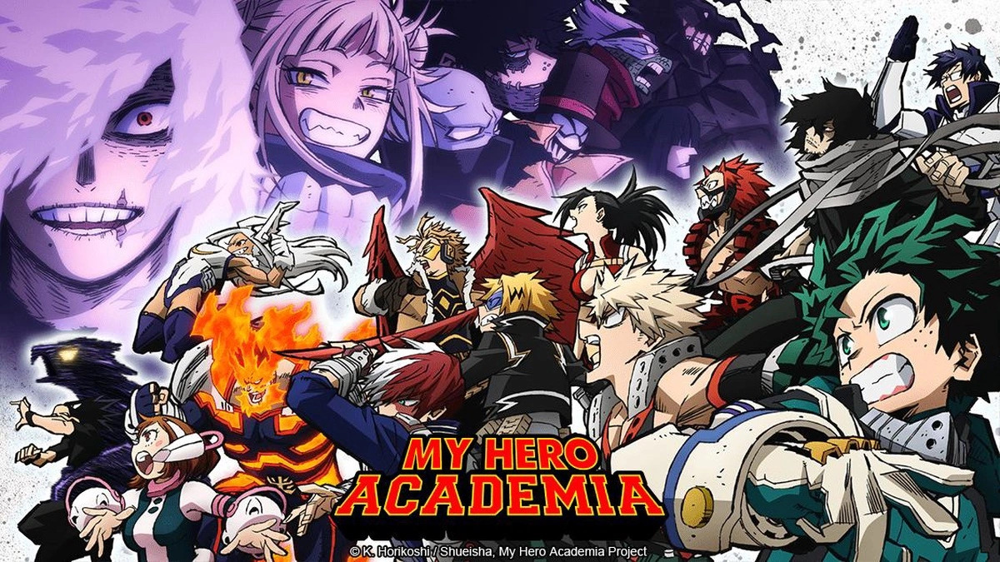
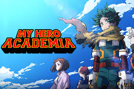
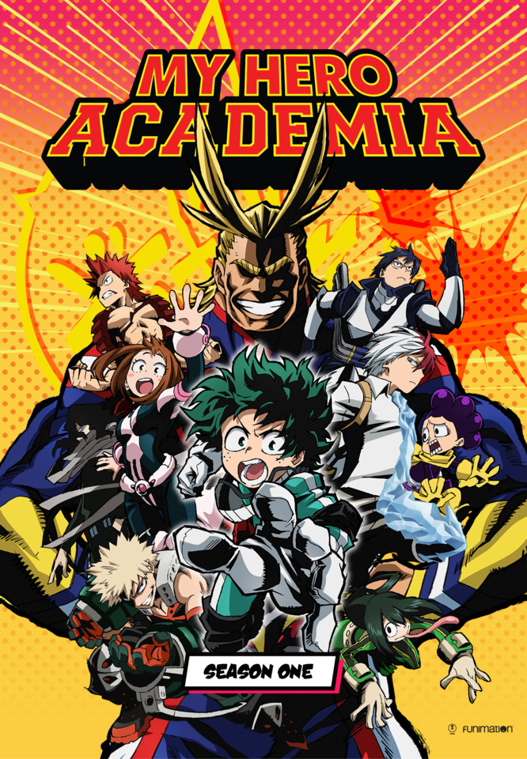

# Anime Series: My Hero Academia

# Description

"My Hero Academia" is a Japanese manga series written and illustrated by Kohei Horikoshi. It's set in a world where nearly everyone possesses superpowers known as "Quirks." The story follows Izuku Midoriya, a boy born without a Quirk in a society where having one is the norm. Despite lacking powers, Midoriya dreams of becoming a hero like his idol, All Might, the world's greatest hero.

The plot kicks off when Midoriya encounters All Might and impresses him with his bravery and determination. All Might sees potential in Midoriya and decides to pass on his Quirk, "One For All," to him. With this newfound power, Midoriya gains admission to U.A. High School, a prestigious academy for aspiring heroes, where he trains to become a professional hero.

Throughout the series, Midoriya faces various challenges, including fierce rivalries, dangerous villains, and personal growth struggles. He forms friendships with classmates such as Katsuki Bakugo, his childhood friend turned rival, and Ochaco Uraraka, a girl with the power to manipulate gravity. Together, they navigate the trials and tribulations of hero training while combating threats to society.

As the story progresses, Midoriya and his classmates participate in internships, battles against villainous organizations like the League of Villains, and high-stakes exams to hone their abilities and become licensed heroes. Along the way, they discover the complexities of heroism, the importance of teamwork, and the impact of their choices on the world around them.

"My Hero Academia" explores themes of heroism, friendship, perseverance, and self-discovery against the backdrop of a society grappling with the responsibilities and consequences of superpowers. The series has garnered widespread acclaim for its compelling characters, dynamic action sequences, and thought-provoking storytelling, making it a beloved and influential part of contemporary manga and anime culture.

# Author:  Kohei Horikoshi

The author of "My Hero Academia" is Kohei Horikoshi. He is a Japanese manga artist and writer known for creating this popular series. Horikoshi was born on November 20, 1986, in Aichi Prefecture, Japan. "My Hero Academia" has gained immense popularity both in Japan and internationally, earning Horikoshi widespread recognition and acclaim for his storytelling and artwork.

|Characters|
|----------|
|Izuku Midoriya (Deku): The protagonist of the series, Izuku is a determined and kind-hearted boy born without a Quirk. He idolizes All Might and inherits the Quirk "One For All" from him, setting him on the path to becoming a hero.|
Katsuki Bakugo (Kacchan): Izuku's childhood friend turned rival, Katsuki possesses the Quirk "Explosion," which allows him to create powerful blasts from his palms. He is fiercely competitive and driven to become the strongest hero.
Ochaco Uraraka: A cheerful and optimistic girl with the Quirk "Zero Gravity," Ochaco can make objects float by touching them. She admires Izuku's determination and forms a close friendship with him.
Tenya Iida: The class president of Class 1-A at U.A. High School, Tenya has the Quirk "Engine," which grants him super-speed by propelling engines in his legs. He values rules and discipline and takes his role as a hero seriously.
Shoto Todoroki: A stoic and reserved student with a powerful Quirk, Shoto can manipulate both fire and ice thanks to his "Half-Cold Half-Hot" ability inherited from his parents, Endeavor and Rei Todoroki. He struggles with his complicated family history but strives to be a hero on his own terms.
All Might (Toshinori Yagi): The Symbol of Peace and the world's greatest hero, All Might possesses the Quirk "One For All." He mentors Izuku and inspires him to become a hero despite not having a Quirk initially.
Eraser Head (Shota Aizawa): The homeroom teacher of Class 1-A at U.A. High School, Eraser Head has the ability to erase other people's Quirks by looking at them. He is strict but cares deeply for his students' development as heroes.
Tsuyu Asui (Froppy): A laid-back and straightforward student with the Quirk "Frog," Tsuyu has traits similar to those of a frog, including enhanced jumping ability and a prehensile tongue. She is known for her level-headedness and reliability.
Minoru Mineta (Grape Juice): A perverted and quirky student with the Quirk "Pop Off," Minoru can produce and detach sticky, grape-like balls from his head. Despite his flaws, he occasionally shows moments of bravery and ingenuity.
Momo Yaoyorozu (Creati): An intelligent and resourceful student with the Quirk "Creation," Momo can create any non-living object as long as she understands its molecular structure. She is known for her strategic thinking and leadership skills.
